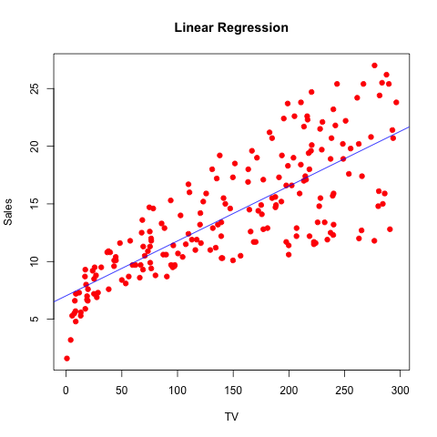

##Abstract

This paper is a simple linear regression of Sales and TV advertising spending from a dataset of 200 markets. Utilizing the least squares method, the model was fit to the data and analysed. This showed a significant (at the 0.01 level) linear relationship of the two variables with an R^2^ value of 0.61. Future experiments of this trend could limit the respondents to markets who exclusively use TV advertising, to limit the confounding effect of other types of advertising on sales. Additionally, a model with interactions of all of the mediums of advertising could be performed. 

##Introduction

  The goal of this paper is to use simple linear regression to analyse how money spent on TV advertising and Sales are correlated for the purpose of improving marketing. By utilizing the tools of R, this project will create a linear model of the data and use it to better understand the relationship bettween advertisement spending on TV and Sales. 
  
  With constant development of new forms of medium, companies have many more options in advertising. Current business theory provides the notion that spending on advertising over different mediums and with different subjects can drive sales. By isolating all television adversiments in this period, we hope to determine if spending on TV advertisements is correlated with higher overall sales. 

##Data

The data of this analysis comes from the text *An Introduction to Statistical Learning* authored by Gareth James, Daniela Witten, Trevor Hastie and Robert Tibshirani. This data comes from 200 markets, with response variables of thousands of dollars spend on TV, Radio, and Newspaper advertisement, as well as the number of units sold (in thousands).


##Methodology

Looking specifically at the TV and Sales data, we ran a linear model of the Sales (in thousands of units sold) onto the TV advertising (in thousands of dollars spent).

We based our model on the simple linear model with an intercept and coefficient:

$$Sales = \beta_0 + \beta_1 TV$$

To find the intercept and coefficient, the data was fit using `lm()` in R. This process utilized the least-squares regression method. 

##Results

The fitted model of the regression is included in Table 1. 

```{r echo=FALSE}
load('../data/regression.RData')
library(xtable)
options(xtable.caption.placement = 'top', xtable.comment = FALSE)
```

```{r echo=FALSE, xtable, results="asis" }
reg_table <- xtable(sumreg$coefficients, caption="Information about Regression Coefficients")
print(reg_table, type="latex")

```

Further analysis of the least squares model is shown in Table 2.


```{r echo=FALSE, results="asis" }
mytable <- data.frame("Value" = c('RSS', 'R2', 'F-Stat'), "Quantity" = c(sumreg$sigma, sumreg$adj.r.squared, sumreg$fstatistic[1]))
rss_table <- xtable(mytable, caption="Regression Quality Indices")
print(rss_table, type="latex", include.rownames = FALSE)
```


There is a strong linear relationship of these two variables. For the values of Sales, about 61% of the variability can be explained by the variation of TV advertising according to the R^2^ of the linear model.It is highly unlikely that this data would be seen without the underlying correlation, we would expect results this extreme less than 1% of the time under the normal distribution.

Further analysis of the data is required to determine any causal relationships. There was no control for confounding factors, so this correlation may be due to an outside factor that is not present in our model. Further tests on our assumptions of variance is also necessary. Anaylsis of the scatterplot of the data (Fig. 1) shows that there is non-constant variance of the results, that the residuals of the model increase with increase in money spent on advertising.





##Conclusions


We can conclude from this data that there is a strong linear relationship between money spent on TV advertising and the sales of units in each market; the data has high correlation. As anticipated and explained by marketing theory, the more money a firm spends on advertising of all forms on television, the more sales a firm experiences. We have not fully ruled out that we have assumed this causal relationship backwards, that perhaps firms with high sales can afford greater expenditure on television advertisement, but it is clear that these two measures increase and decrease together.


